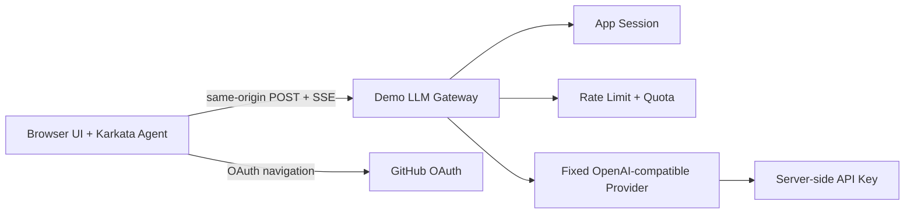

# Karkata Demo：浏览器 Agent 与受限 LLM Proxy

## 状态

Draft。本文是 demo 的实现基线；实现前需要根据实际部署环境补充域名、存储和额度数值。

## 目标

验证以下真实链路：

1. 用户使用 GitHub 登录。
2. 浏览器创建并运行 Karkata Agent。
3. Agent 通过浏览器 UI 展示流式回答、工具状态、取消和持续会话。
4. OpenAI-compatible 请求通过同源后端 Proxy 发送到真实 Provider。
5. Provider Key 不离开后端，代理请求有身份、限流、额度和审计边界。

## 非目标

- 不把 Karkata Agent 主循环放到服务端。
- 不实现通用 OpenAI 代理、任意 Provider 转发或用户自定义 `baseURL`。
- 不开放匿名真实模型调用。
- 不在浏览器执行敏感业务工具。
- 不在第一版实现多 Provider 路由、订阅支付或复杂组织权限。

## 拓扑



## 认证

公开接口：

```text
GET  /auth/github
GET  /auth/github/callback
POST /auth/logout
GET  /api/me
```

OAuth 回调必须校验一次性 `state` 和严格配置的 `redirect_uri`。回调成功后只创建本地 Session，不把 GitHub access token 发给浏览器。Session Cookie 使用 `HttpOnly; Secure; SameSite=Lax`，并支持过期、撤销和登出。

## LLM Proxy 契约

```text
POST /api/llm/chat/completions
```

浏览器发送 OpenAI-compatible 子集，服务端只接受并重新构造允许的字段：

- `messages`：限制角色、数量、单条长度和总字节数。
- `tools`：只作为模型上下文数据传递，不由 Proxy 执行；限制数量、名称和 Schema 大小。
- `model`：可选 hint，由服务端白名单策略决定是否采用。
- `stream`：仅允许 `true`，第一版统一使用 SSE。

服务端拒绝或忽略：

- `baseURL`、`apiKey`、`Authorization`、Provider Header。
- 任意 URL、未知字段、客户端重试策略。
- 客户端的 `systemPrompt`、`maxSteps`、`timeoutMs` 和成本限制覆盖值。

服务端固定：上游 URL、API Key、默认模型、最大输出、超时、重试次数、工具策略和响应头。上游只使用服务端配置的 Key。

## 额度与限流

每次请求顺序：

```text
Session -> request validation -> rate limit -> reserve max cost
        -> upstream SSE -> settle actual usage -> release remainder
```

初始建议值，写入服务端配置而非前端：

| 维度 | 限制 |
| --- | ---: |
| 用户并发运行 | 1 |
| 用户频率 | 3 次/分钟 |
| IP 频率 | 10 次/分钟 |
| 单次输入 | 4,000 字符 |
| 单次输出 | 1,500 tokens |
| Agent 最大步骤 | 4 |
| 单次运行时长 | 45 秒 |
| 全站预算 | 可配置硬上限 |

额度预占必须是原子操作。Provider 不返回 usage 时按预占上限结算，不得按零成本处理。客户端断开、取消、超时和上游错误都要结算已发生或保守估算的成本。

## SSE、取消和错误

Proxy 返回：

```http
Content-Type: text/event-stream
Cache-Control: no-store
X-Accel-Buffering: no
X-Request-Id: <opaque-id>
```

浏览器断开连接时取消上游 Fetch；设置连接、首字节、总时长和最大响应字节限制。错误对外只返回稳定错误码、是否可重试和 request id，不返回 Provider 原文、Header、堆栈或密钥。

## 验收标准

- 未登录用户不能调用 Proxy。
- 登录回调不能通过伪造或重放 `state` 建立 Session。
- 浏览器网络和状态中没有 Provider Key 或 GitHub access token。
- 客户端提交任意 `baseURL` 不会改变上游目标。
- 客户端提交高额度、无限步骤或任意模型不能突破服务端上限。
- 正常 SSE 能完成，浏览器取消能让上游请求尽快收敛。
- 并发、频率、额度和全站预算限制在服务端生效。
- 日志不包含完整 prompt、响应、Cookie、Authorization 或 Key。
- 默认测试不调用真实 GitHub 或 Provider；显式 smoke 才允许真实凭据。

## 分阶段实现

1. 建立前后端 TypeScript/Vite 服务骨架、共享类型和本地假 Provider。
2. 实现 GitHub OAuth、Session 和 `/api/me`。
3. 实现固定上游的 SSE Proxy、请求校验、取消和错误映射。
4. 接入浏览器 Karkata Agent 与 UI Store，验证流式、工具和会话。
5. 加入 Redis 或等价存储的限流、额度预占、结算和审计。
6. 用测试账户运行真实 Provider smoke，检查取消、预算和 Key 隔离。

